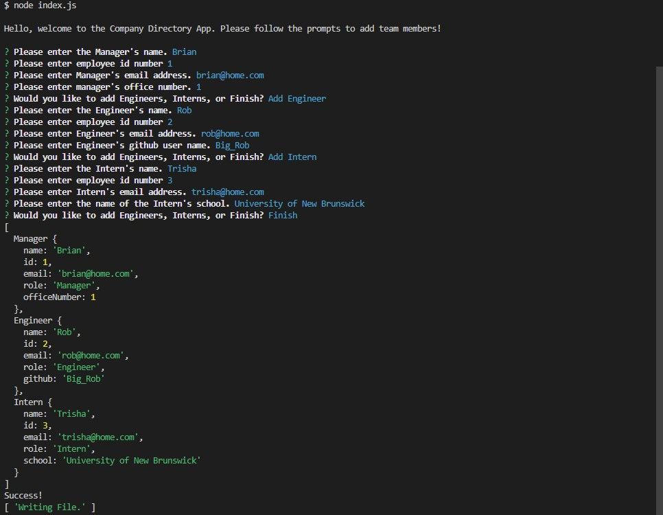
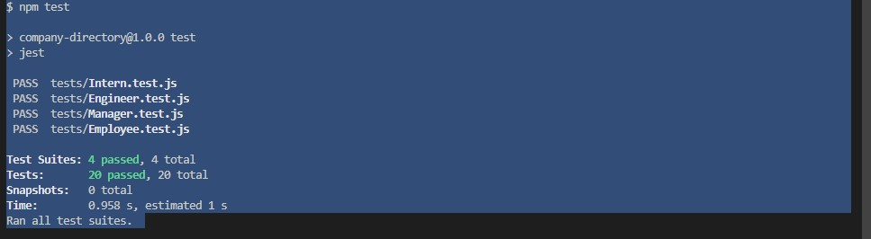

# Company Directory

  

  ## Description

  A node.js app that allows a user to build a company directory from the command line.

  ## Contents
  
  - [Usage](#usage)
  - [Contributions](#contributions)
  - [Tests](#tests)
  - [Questions](#questions)

  ## Usage

  Open the index.js file in terminal and use node index.js to run the program. Follow the provided prompts to build your team, adding a manager and then as many     engineers or interns as you wish. Select finish when you're done and an html page displaying your team will be generated.
  
  

  ## License

  This project is licensed under BSD 3-Clause. For more information (if applicable), please click the following button to learn more:

  

  ## Contributions
  
  Feel free to use the template as you'd like, building on it if you wish or suggesting additions and edits.

  ## Tests
  
  Simply run npm test in the terminal to run the included tests using the jest framework.
  
  

  ## Questions
  
  For any questions or comments please reach out to me through github.
  
  https://github.com/Meduion
